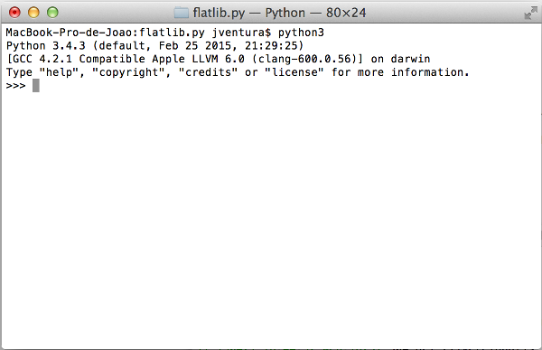

Introduction to Python
======================

The purpose of this tutorial is to show you how you can quickly start working with the Python programming language. 
It assumes that you have already succesfully installed Python in your computer.
If you already know how to use Python, you can skip this tutorial.

Interactive interpreter
-----------------------

Python is a general purpose programming language that bundles an interactive interpreter. 
To start the interactive interpreter, open the terminal (command prompt in Windows) and execute ``python3`` 
(or ``py`` in Windows)

   
.. Cimage:: ../_static/python-interpreter-win32.png
   :align: center
   
In the interactive interpreter, you can enter commands and the Python interpreter will execute those commands and 
return the answers.

Print command
-------------

The *print* command is one of the most useful commands in Python, since it allows us to print the contents of python
*variables*. For instance, try the following in your Python interpreter::

   >>> print('Hello, world!')
   Hello, world!

You can see that the interpreter will print the exact contents of whatever you put between quotation marks (called string).
Try to print other strings.

Variables
---------

In computer languages, variables are reserved memory locations to store values. Basically, when you create a variable, 
the Python interpreter allocates memory and stores a value in that memory location. The equal sign (=) is used to assign 
values to variables. Try the following in your interpreter::

   >>> number = 100
   >>> miles = 1000.0
   >>> name = "John"
   >>> print(number)
   100
   >>> print(miles)
   1000.0
   >>> print(name)
   John
   
You can assign integer numbers to variables, floating point numbers and strings.

Basic Operations
----------------

Since variables may include numbers, strings or other objects, Python allows us to do some basic operations on 
variables, such as adding, subtracting, multiplying or divinding. Some of those operations make more sense on numbers,
but others may be applied in strings as well.

Try the following operations on numbers::

   >>> num1 = 10
   >>> num2 = 20
   >>> num1 + num2
   30
   >>> num1 - num2
   -10
   >>> num1 * num2
   200
   >>> num1 / num2
   0.5
   
Now let's see how it works for strings::

   >>> name1 = 'Homer'
   >>> name2 = 'Simpson'
   >>> name1 + name2
   HomerSimpson
   >>> name1 - name2
   Traceback (most recent call last):
     File "<stdin>", line 1, in <module>
   TypeError: unsupported operand type(s) for -: 'str' and 'str'

Some operations do not make sense for strings.

Assignment operator
-------------------

Something very important in programming languages is the assigment operator. We have already discussed it above when
we assigned numbers and strings to variables using the equal operator (=). The important thing to notice is that we
can assign the result of an operator to a variable like in the following example::

   >>> num1 = 10
   >>> num2 = 20
   >>> result = num1 + num2
   >>> print(result)
   30
   >>> result   # This also works in the interpreter
   30
   
   
Python lists and dictionaries
-----------------------------

In Python, there are two special data structures called *lists* and *dictionaries*. 
A list is basically a sequence of variables which can be or not of the same data type. 
Here is a simple example::

   >>> mylist = [-5, 0.3, 2.5, 33]
   >>> mylist[0]
   -5
   >>> mylist[1]
   0.3
   >>> mylist[0] + mylist[1]
   -4.7
   
We can access the individual contents of a list by referring to the index number between brackets. 
For instance, ``mylist[1]`` returns the contents of *mylist* at index 1. Lists are zero-based.

A dictionary is a data structure somewhat similar to lists but which do not represent sequences of variables.
Here is an example for dictionaries::

   >>> mydict = {'name': 'John Doe', 'age': 32, 'gender': 'male'}
   >>> mydict['name']
   John Doe
   >>> mydict['age']
   32
   >>> mydict['age'] = 32 * 2
   >>> mydict['age']
   64

Similarly to lists, you can access the individual contents of a dictionary using the index value between brackets.
But unlike lists, you can also use strings or other objects as *key*.

Python modules
--------------

Python provides different functionalities organized by *modules*. A module is a file containing Python definitions, 
statements and functions.

Python comes with a library of standard modules which provides many functionalities.
To access a module you must explicitly import it using the *import* command. Here is an example of importing
the *math* module to use some of its functions::

   >>> import math
   >>> math.factorial(10)
   3628800
   >>> math.log(20)
   2.995732273553991

The Python Library Reference describes the standard library that is distributed with Python, and can be found at 
https://docs.python.org/3.4/library/index.html.

More about Python
-----------------

The purpose of this tutorial is just to give you enough knowledge on Python to get you started with *flatlib*. 
There are many more tutorials on the internet which may give you deeper knowledge of the Python programming language.

The Python community provides an official tutorial which can be found at https://docs.python.org/3.4/tutorial/index.html.  